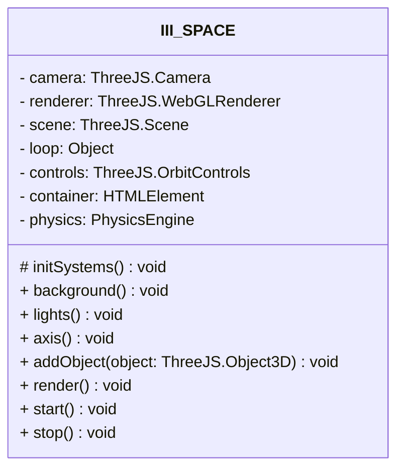
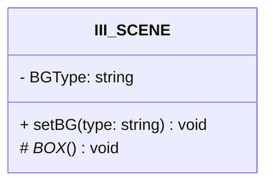
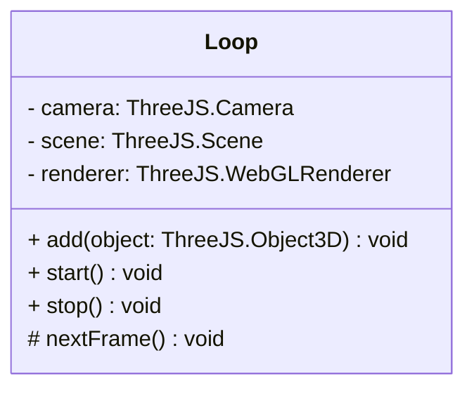
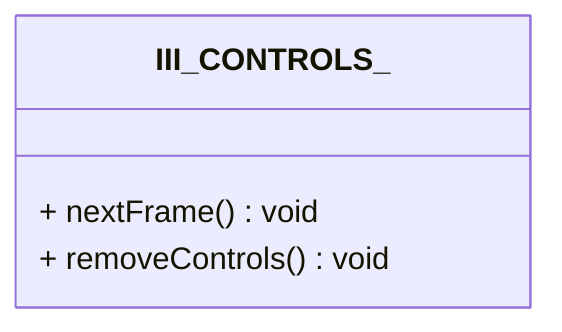
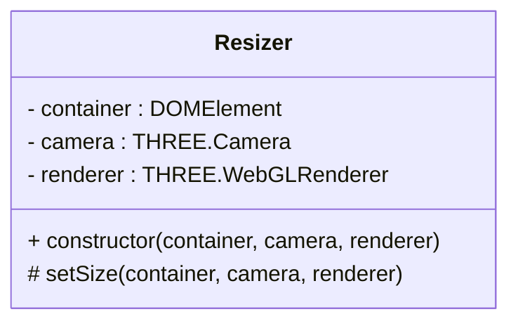

# ThreeJS_III

Another abstraction level for computer graphics on the web.


## Usage

Implements pipeline by extending `III_SPACE` class:

```js
/**
 * 26/03/2023 - CDMX/México
 * @author: Alexis Tercero
 * @mail : alexistercero55@gmail.com
 * @github: AlexisTercero55
 */

import III_SPACE from "../threejs_iii/BASE/III_Space";
import floor from "../threejs_iii/III_Primitives/FLOOR";
import sky from "../threejs_iii/III_BACKGROUNDS/III_SKY";
import fresnel_bubble from "../threejs_iii/III_SHAPES/fresnelBubble";

export default class III_SHADERS extends III_SPACE
{
    constructor(container){
        super(container,
            {
                SceneRotation:true,
                POV:{x:6,y:6,z:6},
            });
    }

    createObjects()
    {
        let d = 2;
        let buuble1 = fresnel_bubble(
            this.renderer,
            this.scene,'metalic');
        buuble1.position.set(d,2,d);
        this.addObject(buuble1,true)

        let buuble2 = fresnel_bubble(
                    this.renderer,
                    this.scene);
        buuble2.position.set(-d,2,-d);
        this.addObject(buuble2,true)

        this.addObject(sky())
        this.addObject(floor())
        this.axis();
    }
}
```

## Core

### III_SPACE | ThreeJS_III output



### III_SCENE | Factory of THREE.Scene



### Loop

Manage the animation loop and the render.



### III_CONTROLS_ | Factory of THREE.OrbitControls



### Resizer

Manage the render resize event.


